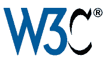

Users can interact with functional images, for example if they are used as buttons or within links. The text alternative for the image should convey the action that will be initiated (the purpose of the image), rather than a description of the image. 

For instance, as shown in examples below, the text alternative should be “print this page” rather than “(image of a) printer”, “search” rather than “magnifying lens” or “Example.com homepage” rather than “Example.com logo”.

Images acting as stand alone links should have the appropriate text value in the `alt` attribute. Missing or empty `alt` values create real problems for screen reader users as links cannot be ignored. The screen reader will announce the image filepath or the URL for the destination page which won’t help users know where the link leads to.

## Image used alone as a linked logo
{:.ex}

The following image is the only content of a link that leads to the W3C homepage. It has the text alternative “W3C home” to indicate where the link will take the user (see [“Logo image within link text” example](#logo-image-within-link-text) if there is other text in the link to identify the destination):

{::nomarkdown}
<%= sample_start %>
{:/nomarkdown}

{::nomarkdown}
<%= sample_end %>
{:/nomarkdown}

{::nomarkdown}
<%= code_start %>
{:/nomarkdown}

~~~ html

~~~

{::nomarkdown}
<%= code_end %>
{:/nomarkdown}

{::nomarkdown}
<%= notes_start %>
{:/nomarkdown}

**Note 1:** In this situation the logo is also an image of the text “W3C” but in this case its primary function is to link to the home page, so the word “home” was added to the text alternative.

**Note 2:** Images used as logos are exempt from some of the accessibility guidance that applies to other images of text, for instance there are no minimum color contrast and text size requirements.

{::nomarkdown}
<%= notes_end %>
{:/nomarkdown}

## Logo image within link text
{:.ex}

In this example the W3C logo is contained within a text link that leads to the W3C homepage. The image has the same function as the text within the link (to identify where the link will take the user). As the link text already provides this information, it acts as the text alternative. The image must still contain an `alt` attribute though, so a null (empty) value is applied, (`alt=""`), to avoid redundancy or repetition. In effect the image is a decorative adjunct to the link text:

{::nomarkdown}
<%= sample_start %>
{:/nomarkdown}

[{:style="vertical-align: middle; margin-right: 1em;"}W3C Home](http://www.w3.org/)

{::nomarkdown}
<%= sample_end %>
{:/nomarkdown}

{::nomarkdown}
<%= code_start %>
{:/nomarkdown}

~~~ html
<a href="http://www.w3.org/">
	 W3C Home
</a>
~~~

{::nomarkdown}
<%= code_end %>
{:/nomarkdown}

{::nomarkdown}
<%= notes_start %>
{:/nomarkdown}

**Note:** Where an image and text are both contained in a single link anchor, the image should be treated as decorative, although it functions as part of the link, unless it contains additional information that is pertinent to the link (see example 3). Another example of this technique can be found under [decorative images](decorative.html).

{::nomarkdown}
<%= notes_end %>
{:/nomarkdown}

## Icon image conveying information within link text
{:.ex}

In this example the image follows text within a link to inform users that the link will open in a new window. It has the text alternative “new window” to reflect the representation on the image:

{::nomarkdown}
<%= sample_start %>
{:/nomarkdown}

[W3C Homepage ](http://www.w3.org/)

{::nomarkdown}
<%= sample_end %>
{:/nomarkdown}

{::nomarkdown}
<%= code_start %>
{:/nomarkdown}

~~~ html
<a href="http://www.w3.org/" target="_blank">
	W3C Homepage 
</a>
~~~

{::nomarkdown}
<%= code_end %>
{:/nomarkdown}

{::nomarkdown}
<%= notes_start %>
{:/nomarkdown}

**Note:** This type of icon is often used to indicate different file formats such as AVI, ODF, MP3, PDF, Word, and many more. In this case the text alternative should equally convey the format represented by each icon.

{::nomarkdown}
<%= notes_end %>
{:/nomarkdown}

## Stand-alone icon image that has a function
{:.ex}

The following image is an icon representing a printer to denote print functionality. It has the text alternative “Print this page” because its purpose is to activate the print dialog when it is selected:

{::nomarkdown}
<%= sample_start %>
{:/nomarkdown}

)

{::nomarkdown}
<%= sample_end %>
{:/nomarkdown}

{::nomarkdown}
<%= code_start %>
{:/nomarkdown}

~~~ html

~~~

{::nomarkdown}
<%= code_end %>
{:/nomarkdown}

{::nomarkdown}
<%= notes_start %>
{:/nomarkdown}

**Note:** The same text alternative is applicable when such an icon is used in a button instead of in a link. the next example on this page explains how to code the text alternative for buttons.

{::nomarkdown}
<%= notes_end %>
{:/nomarkdown}

## Image used in a button
{:.ex}

The following image is used to give the button a distinct style. In this case it is the button to initiate a search request and is an icon representing a magnifying lens. The text alternative for the image is “search”:

{::nomarkdown}
<%= sample_start %>
{:/nomarkdown}

<form action="#" method="post">
  

    <label for="search" style="vertical-align: middle; display:inline-block;">Search:</label>
    <input name="search" id="search" type="text" style="vertical-align: middle; display:inline-block;">
    <input name="submit" src="../../img/searchbutton.png" alt="Search" type="image" style="vertical-align: middle; display:inline-block;">
  

</form>

{::nomarkdown}
<%= sample_end %>
{:/nomarkdown}

{::nomarkdown}
<%= code_start %>
{:/nomarkdown}

~~~ html
<input type="image" src="searchbutton.png" alt="Search">
~~~

{::nomarkdown}
<%= code_end %>
{:/nomarkdown}
